# ServiceNow integration

ServiceNow code for integration app.
## 0. Resources
- Documentation: https://www.ibm.com/support/knowledgecenter/en/SSQLRP_2.1/config/aiops-servicenow.html  
- Documents for ServiceNow app certification: https://ibm.ent.box.com/folder/128197471269

## 1. How to import app into ServiceNow instance

Pre-req: Personal access token for Github. If you don't have one, follow the instructions https://docs.github.com/en/free-pro-team@latest/github/authenticating-to-github/creating-a-personal-access-token to create one (no elevated permissions needed for the token).

1. Obtain a developer instance for ServiceNow following the instructions from https://developer.servicenow.com/dev.do#!/guides/paris/now-platform/pdi-guide/obtaining-a-pdi (this requires a ServiceNow account which can be created as part of the steps - just sign up for a new account). Note: development instances go into hibernation when not used and are decommissined if not used for 10 days.
1. Log on to the development instance.
1. Search for `Credentials`.
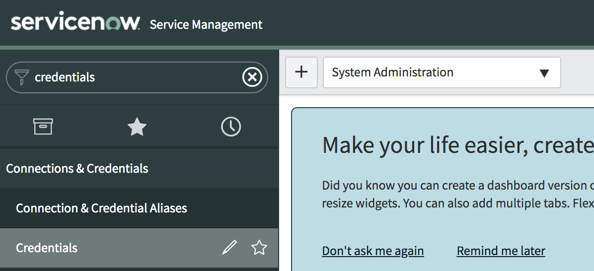
1. Select `Credentials` under `Connections & Credentials`.
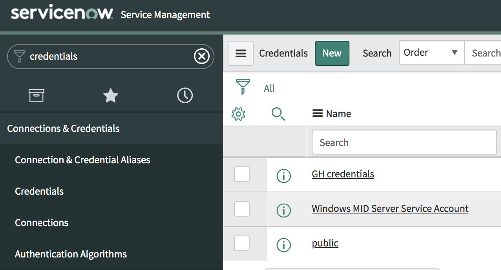
1. Select `Basic Authentication`.
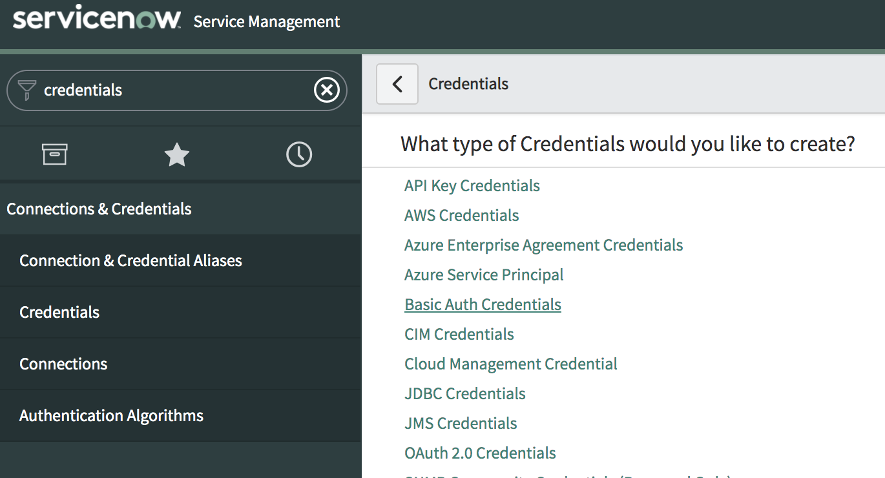
1. Enter any name, provide your login email address for Github and as password provide your personal access token. Then click `Submit`.
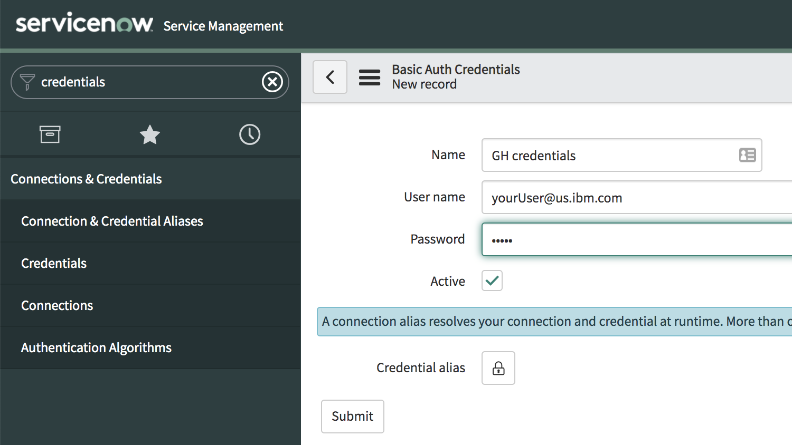
1. In the Search field, type in `Studio`. Select `Studio` under `System Applications`. This will open the Application Studio in a new tab.
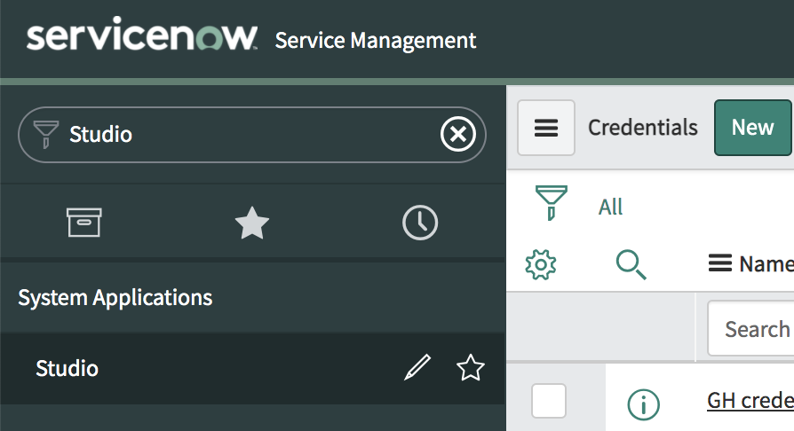
1. In the `Select Application` dialog, click `Import from Source Control`.
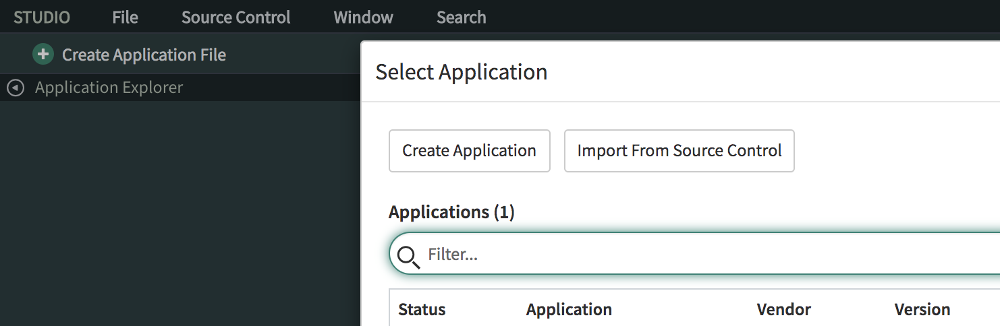
1. Enter `https://github.ibm.com/watson-ai4it/servicenow-integration` as repository, `main` as the branch and in the `Credential` drop-down, select the entry with the credentials that were created in the previous steps.
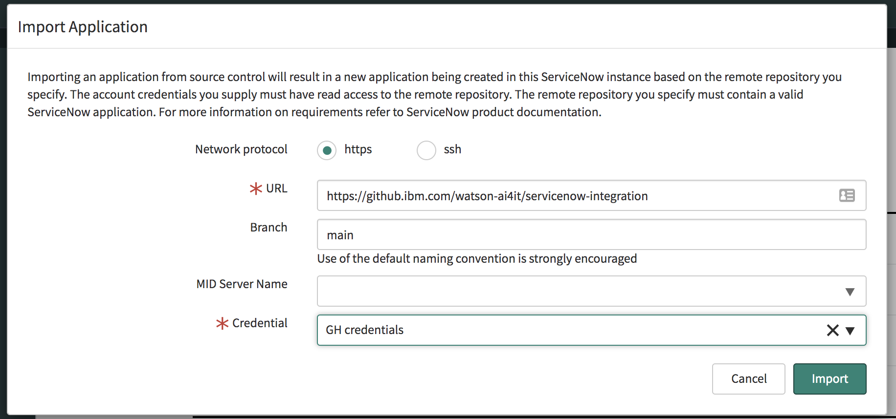
1. Click `Import` to import the source code.

## 2. User flow
Document with user flow: https://ibm.ent.box.com/file/754847279725
## 3. Source code structure
For the integration, we created a new table, REST endpoints and added some additional columns into the `incident` table. To add more resources, click `Create Application File` in the studio and in the dialog, select the type of object you want to create.
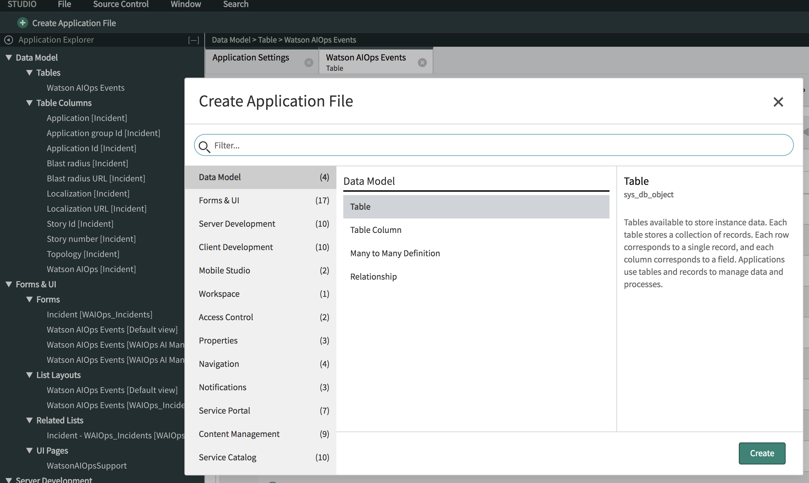
Details of the application:
1. Application Settings  
Launched from File | Settings
Configures application name, version, icon etc. Also sets the scope of the application. The scope is used in any custom items created by the application. Once set, the scope can't be changed from the UI anymore. A work-around is to directly change the source code and replace all occurrences of the scope with the new scope, then re-import the app.
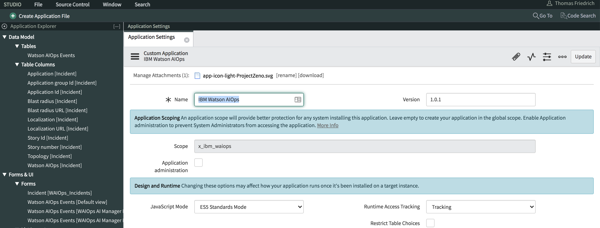
1. Tables  
The application creates a new table `x_ibm_waiops_ai_manager_events` that holds all the data for AIOps events (alerts, log anomalies). It has a reference to the `incident table` (field with type `Reference`). 
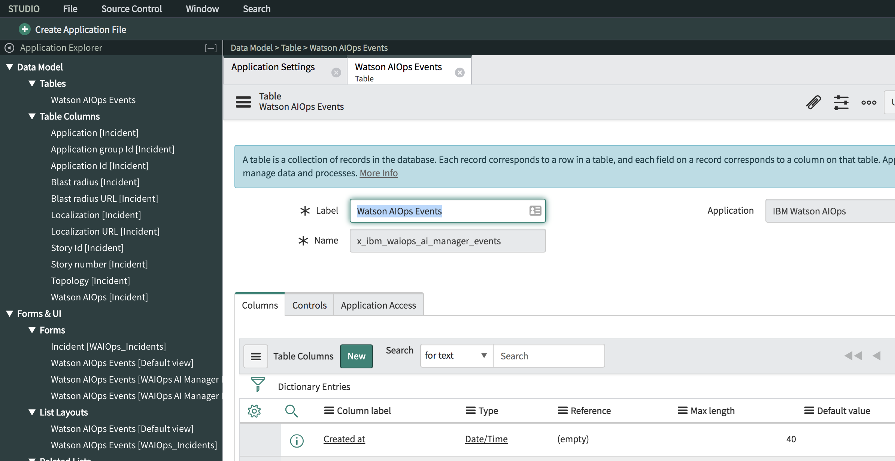
1. Coumns  
When a new story arrives in Watson AIOps, we create a new incident record in ServiceNow. To capture the additional data for the incident, we added a few more columns into the incident table.
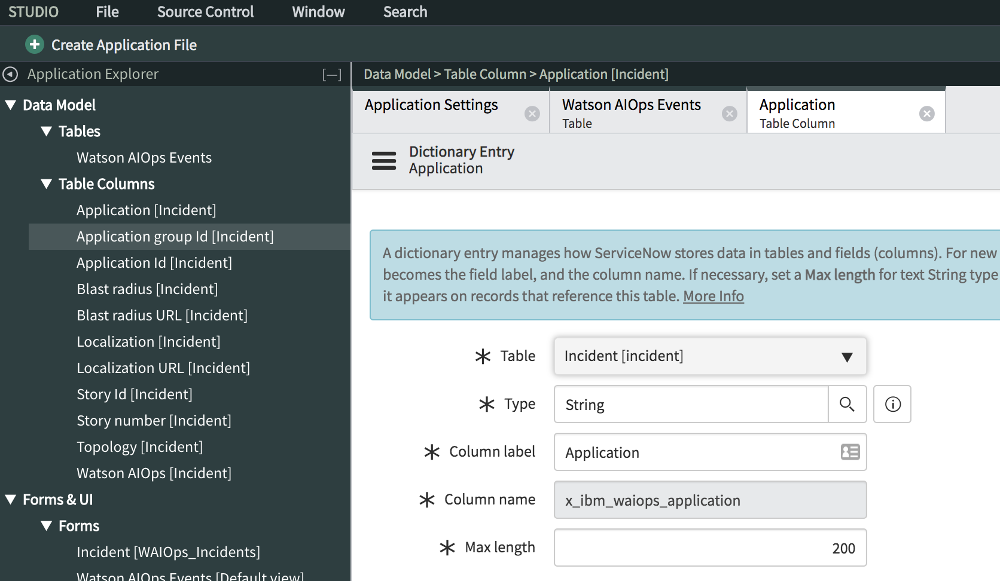
1. Forms  
Forms configure the layout of the data in the Agent Workspace. It configures the updates forms for the Incident, and the forms for the details of events (one for alerts, one for log anomalies).
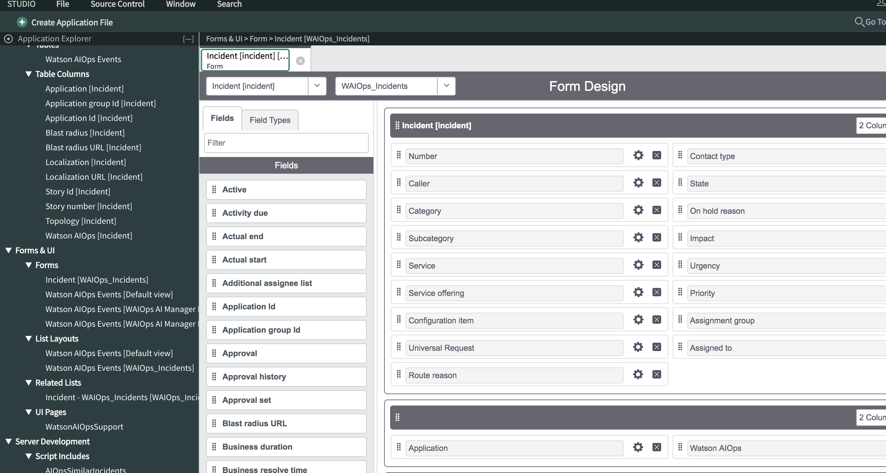
1. List Layouts  
The List Layouts configure the columns that are shown when opening the list of the incidents created by Watson AIOps in the Agent Workspace, and of the list of Watson AIOps events inside an incident created by Watson AIOps.
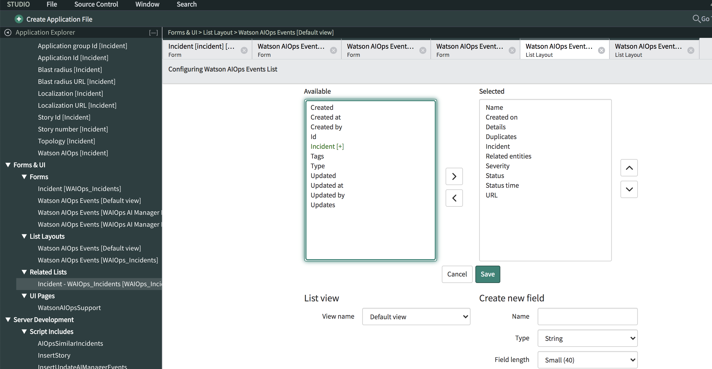
1. UI Pages  
As requested by the ServiceNow certification engineer, we added a page that has links to the product, documentation and support of Watson AIOps. This can be accessed by admins from the Watson AIOps menu.
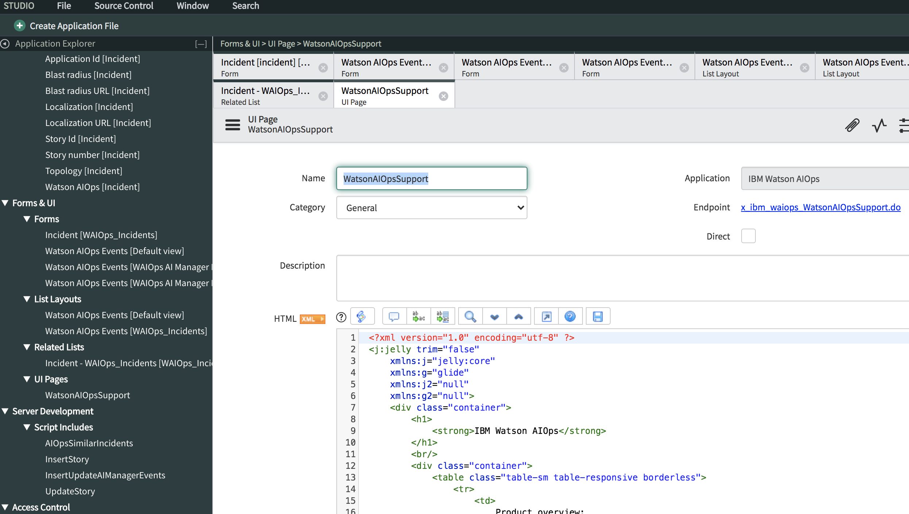
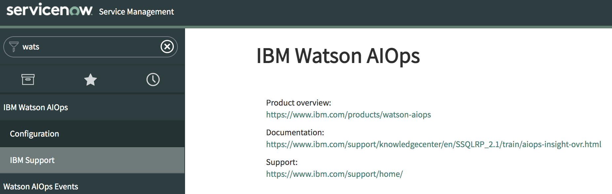
1. ScriptIncludes  
The ScriptIncludes contain the main functionality of the app. Those scripts are called when the endpoints to create or update an incident are called.  
**AIOpsSimilarIncident**: script that is called when launching the Watson AIOps Similar Incident search from Agent Assist. The script first calls the endpoint in WAIOps to get an auth token using the username and password configured in the properties (see System properties below), then calls the endpoint to get similar incidents from the WAIOps API service.  
**InsertStory**: called from POST AIManager endpoint  
**InsertUpdateAIManagerEvents**: script that contains methods to insert or update records into the incident and events table. Called from both InsertStory as wel as UpdateStory.  
**UpdateStory**: called from PATCH AIManager endpoint and PUT Update topology endpoint. Updates the existing incident and AIOps events records  
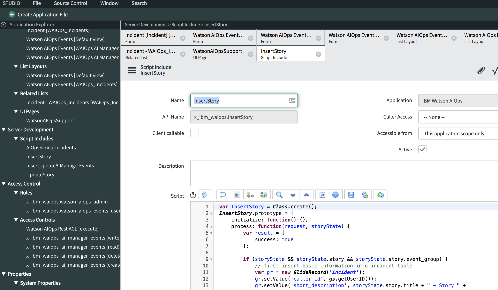
1. Roles  
As part of the app, we created two roles - admin and events_user. The admin has access to the configuration of the app (to avoid that any user can modify the settings). The events_user is the only user who can insert data into the new events table. An agent shouldn't be able to create or update records in the AIOps events table from the Agent workspace because all data is provided by Watson AIOps. 
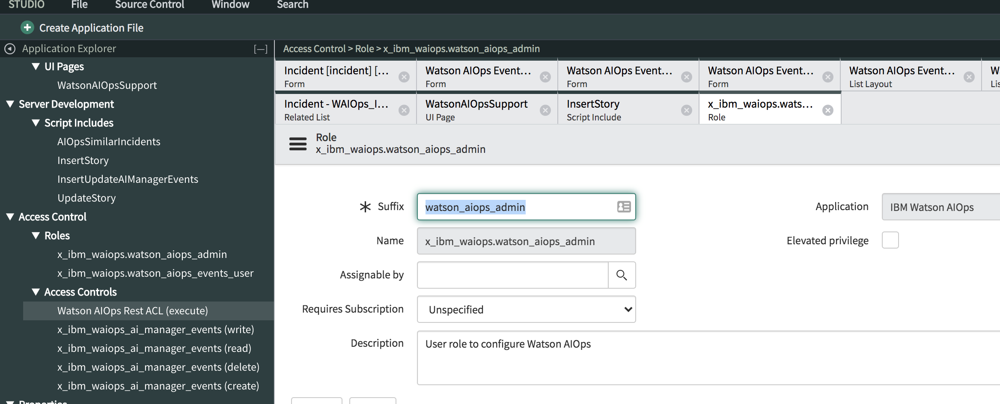
1. Access Controls  
The access controls add a new ACL for the rest endpoints to ensure only an events user can call them (restriction requested by ServiceNow certification engineer). The other access control records are associated with the events table and limit who can create/update/delete records (only events user) or read (events or itil user - itil role is required role for agents to access the Agent workspace)
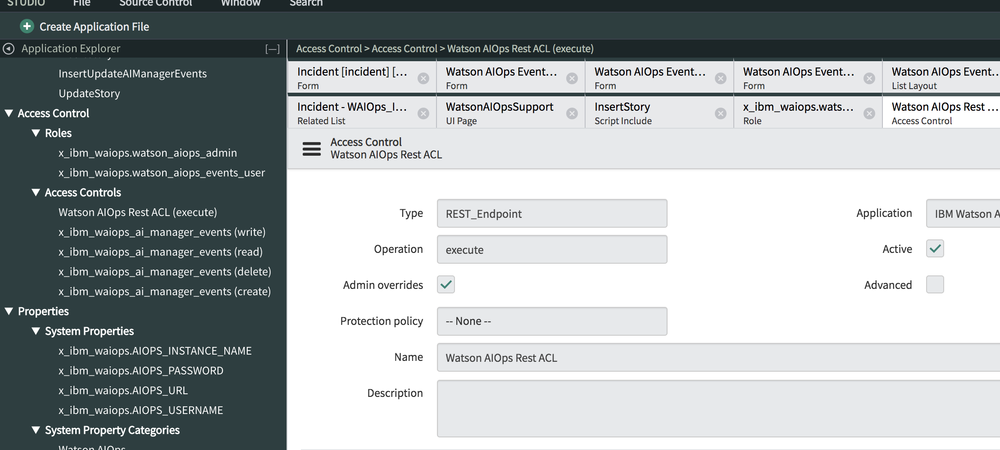
1. System properties and categories  
To configure the connection parameters for Watson AIOps that is used in the similar incident search, we added 4 properties that need to be configured by an admin user beforehand. This configures the URL, instance name and user name and password. ALl prperties are grouped under one category "Watson AIOps". The admin can navigate to the properties by searching for Watson AIOps.
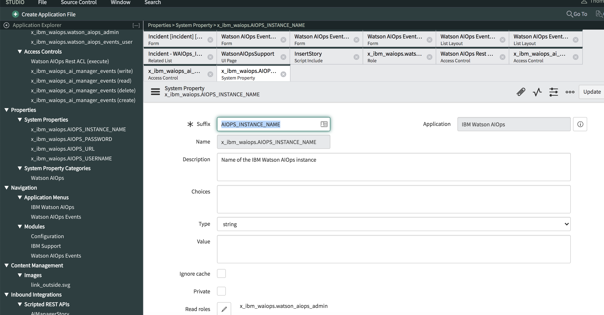
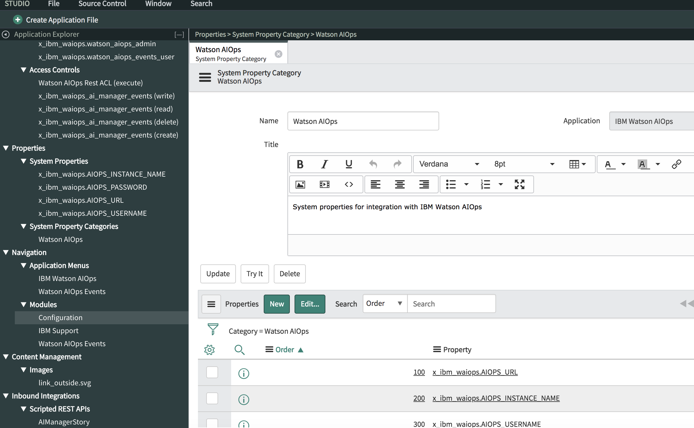
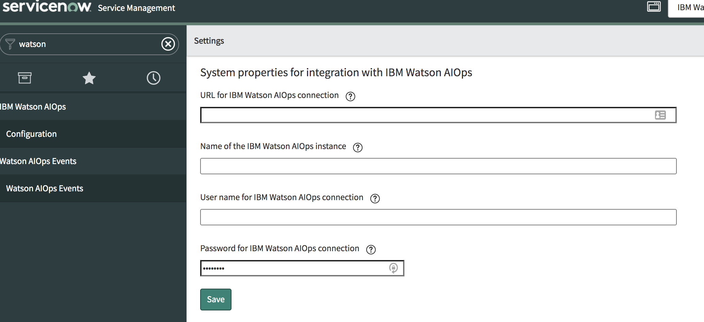
1. Navigation  
Adds the Watson AIOps menu to the app which includes the modules for the `Configuration` and the `Support` page.
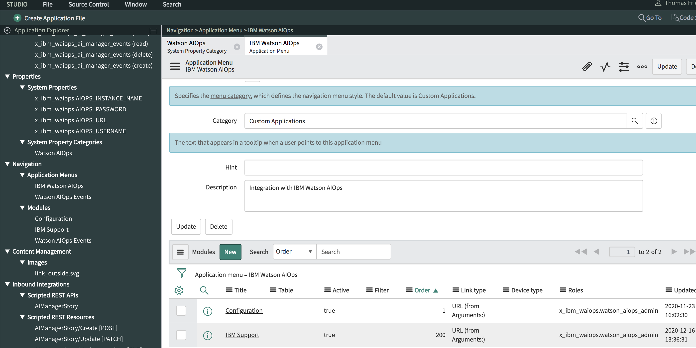
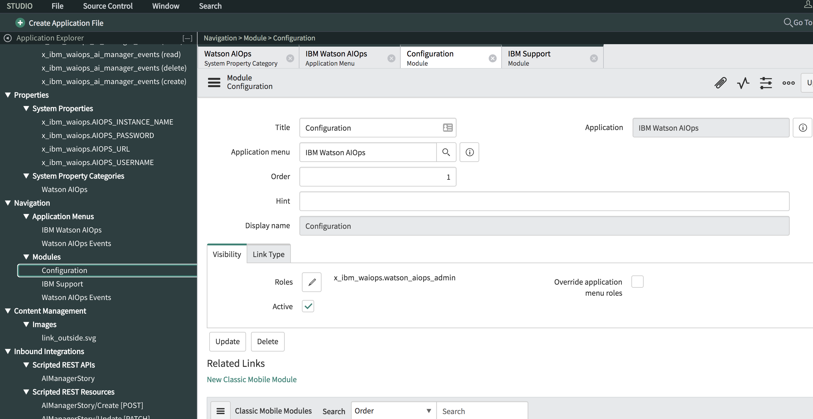
1. Content Management  
We added one image for an outgoing link which is referenced in the field for the Slack URL and the View Details links for Localization and Blast radius.
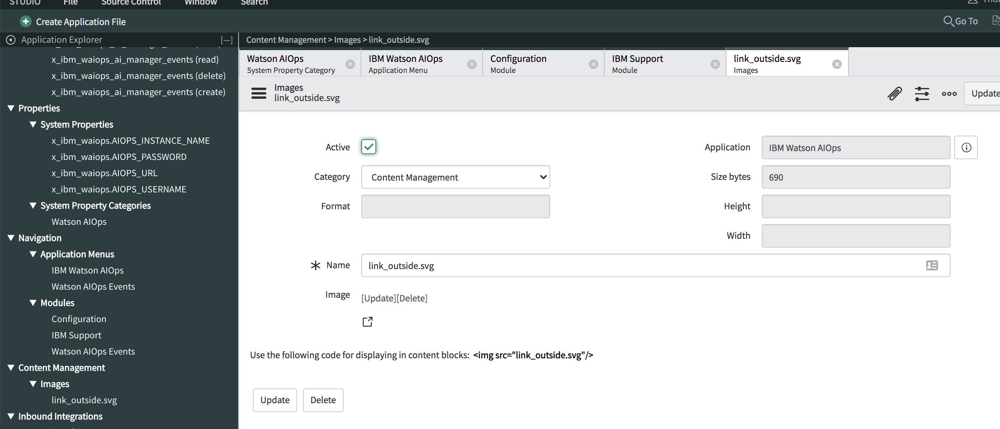
1. Script REST APIs  
The REST APIs create the new endpoints that are called from Watson AIOps to create or update the new incidents.
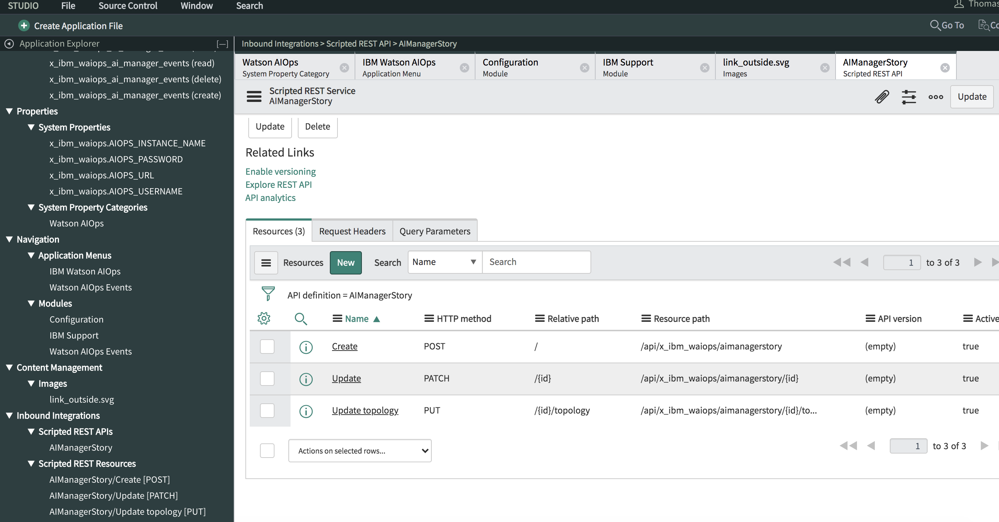
**CREATE**: Called when new story arrives. Calls the ScriptInclude InsertStory to create a new incident record.  
**PATCH**: Called when update for story arrive. Updates the status and the event data of the associated incident.  
**PUT**: As part of the create-flow, we also upload the Localization and Blast radius images to the incident. This is done through the attachement API in ServiceNow. After uploading the images, we need to update the L and BR data fields in the incident to add the HTML data referencing the image and the link to ASM. This is done by this endpoint which calls a method iin the UpdateStory ScriptInclude.  
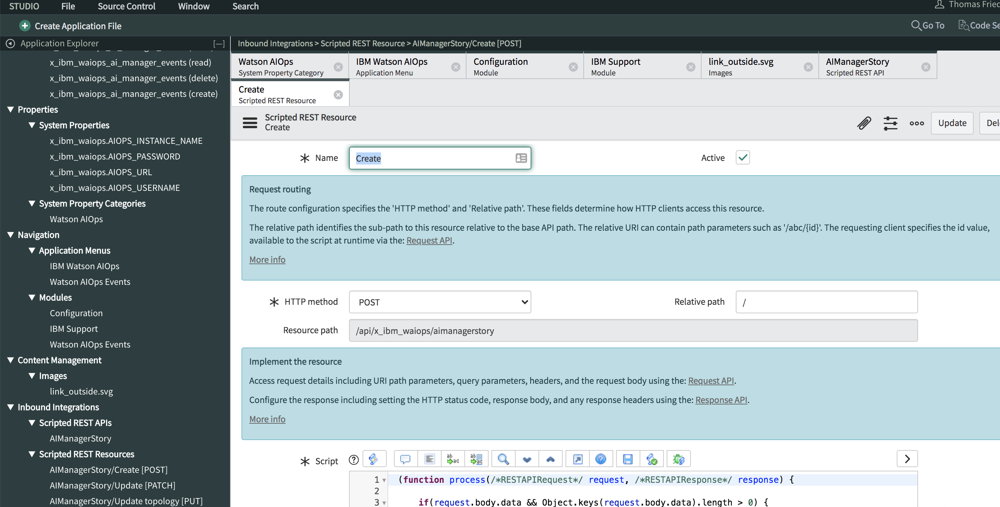

## 4. Publish ServiceNow app to ServiceNow app store
Link to app in app store: https://store.servicenow.com/sn_appstore_store.do#!/store/application/632a6d81db102010253148703996197e/1.0.0  
Pre-req: 
1. Need access to vendor instance https://ven03630.service-now.com/. Can only upload apps to the store from vendor instance (function is disabled from dev instances).  
1. Need credentials for HI portal: https://hi.service-now.com/. Required to access TPP portal for published apps: https://tpp.servicenow.com/sn_appstore_store.do#!/tpp/program  

Reference:  
**Technology Partner Technology Resources:** https://community.servicenow.com/community?id=community_blog&sys_id=546e2eaddbd0dbc01dcaf3231f9619ee&view_source=publisherportal  
**Publish portal:** https://tpp.servicenow.com/sn_appstore_store.do#!/tpp/program

Steps:  
1. Import or edit the app similar into the vendor instance, similar to steps explained in section 1.  
1. After making the required changes and testing the changes locally, go to File | Publish
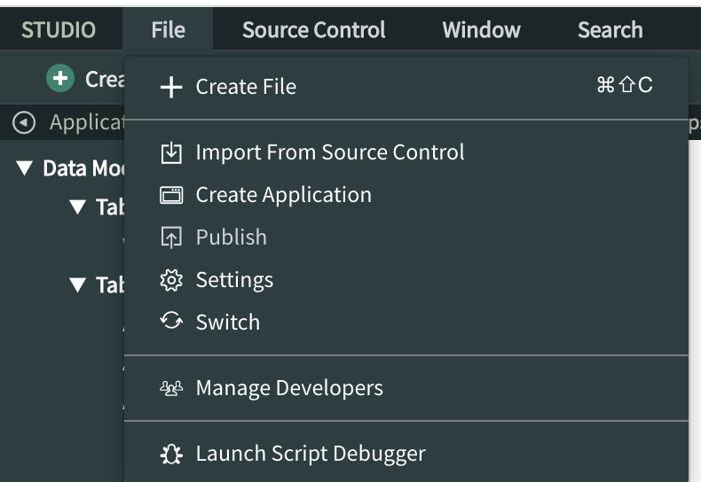
1. In the dialog, select "ServiceNow Store", set a new version (Note that this is just the development version, it won't change the app version. But every publish needs to be a different development version.). At the bottom, fill in your HI credentials.
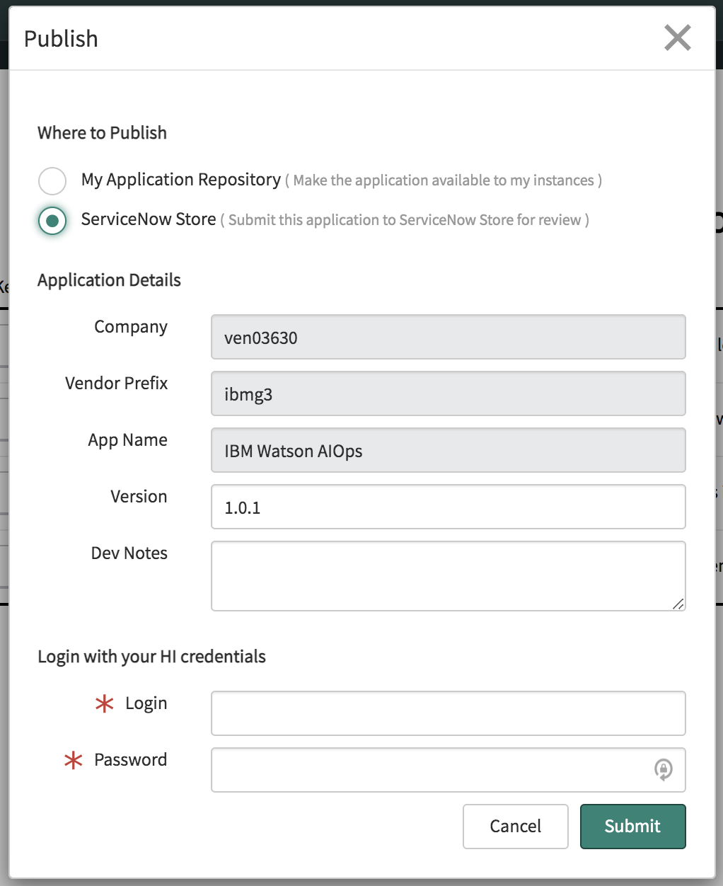
1. Go to TPP publish page: https://tpp.servicenow.com/sn_appstore_store.do#!/tpp/program and log on with HI credentials:
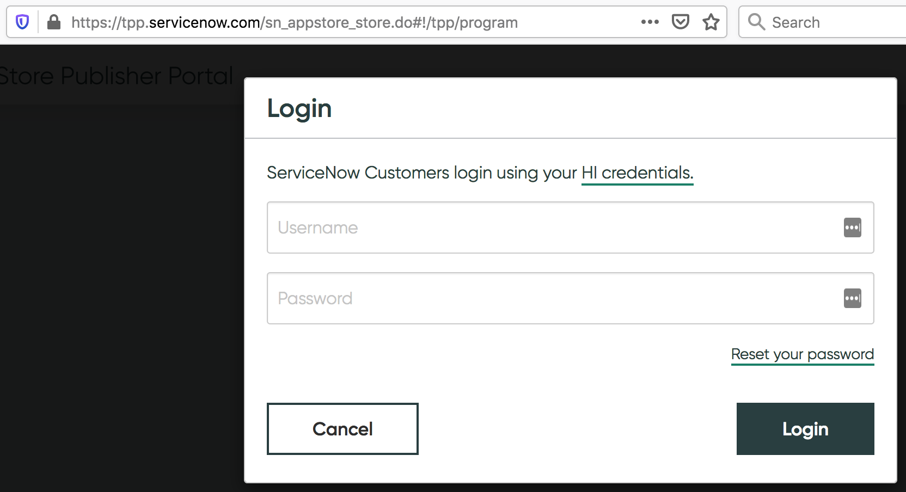

The HI publish portal gives accesss to all apps that are published from the vendor instance.
1. Go to the Certify tab and filter by Published stated. This will show the Watson AIOps app published:
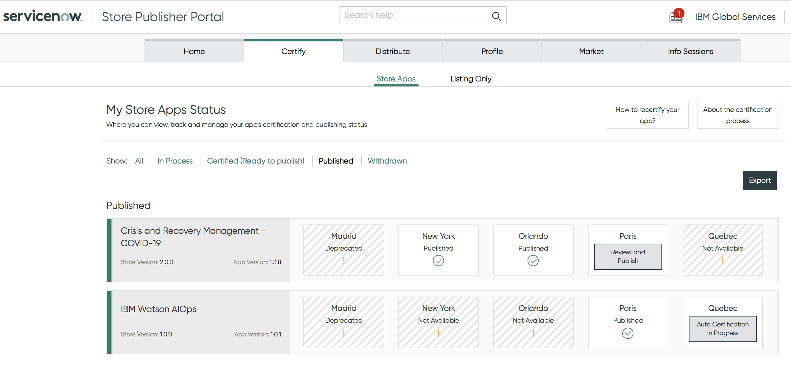
1. When a new version is being published, the app will also show up in the In-Process state.  
The publish process contained two separate review processes:  
**App review:** Review of app code, including demo of the functionality  
**Listing review:** Review of listing of app in app store. You can work with OM to fill out this information.  
The resources that were uploaded for our 1.0 release, are uploaded to box here: https://ibm.ent.box.com/folder/128197471269
1. App review information:
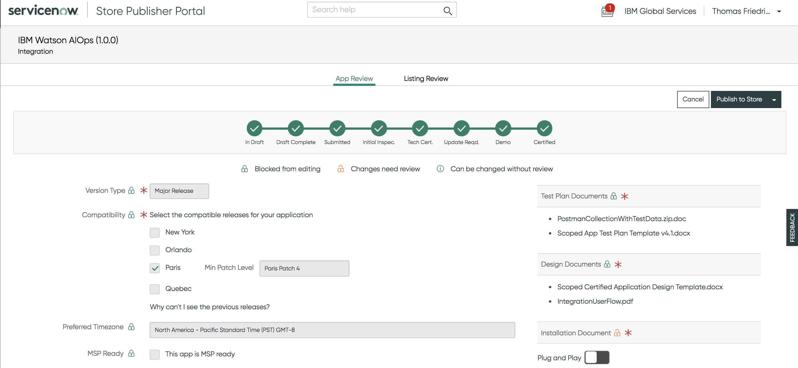
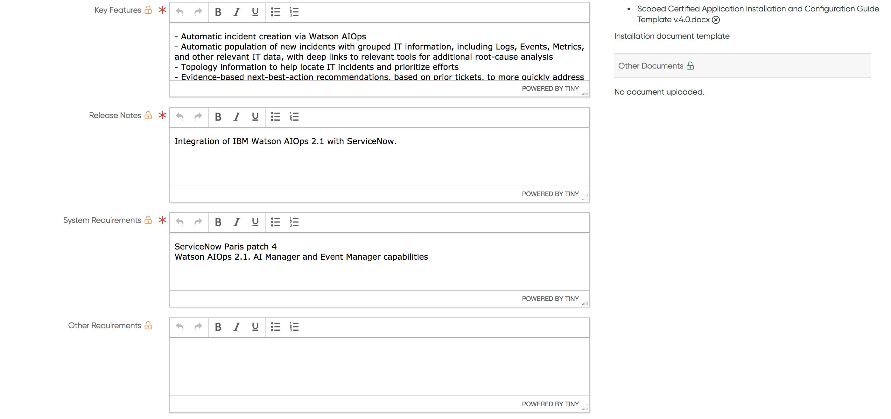
1. Listing review information:
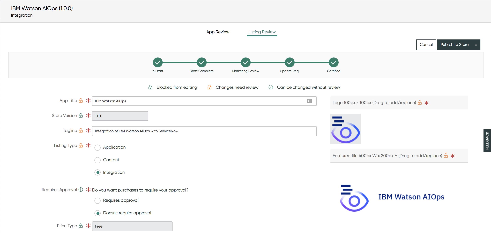
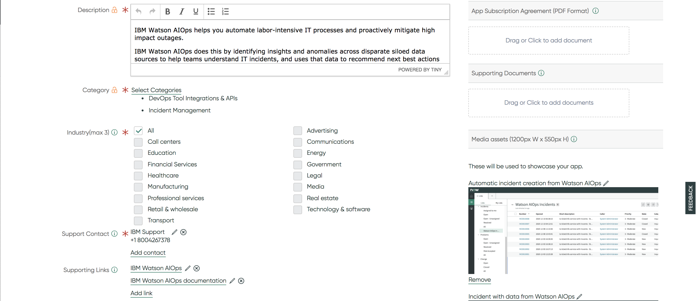
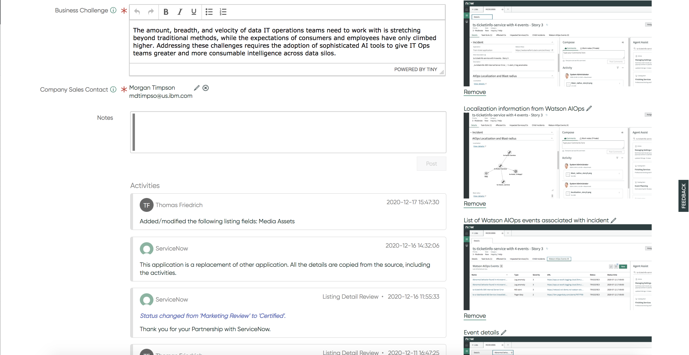
1. After making changes to either the app or the listing review, either one can be submitted independently by clicking on the "Publish to Store" button in the upper right corner. Depending on which field are changed, the app might another review:
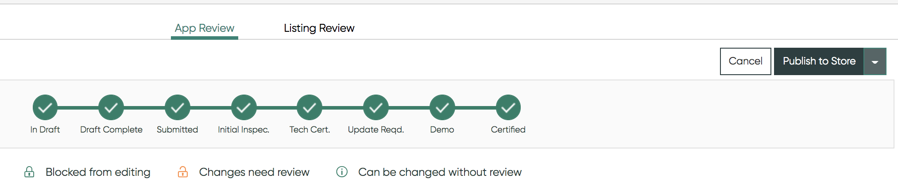
# servicenow-integration-fork
